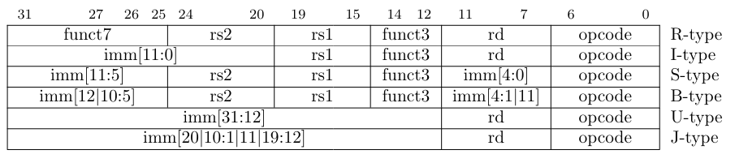

# Format

A typical RISC-V assembly instruction consists of three parts.

{lable:} {operation} {comment}

**label**: Any identifier ending in colon be thought to is lable.

**operation**: it contains a variety of types. 

- instruction: corresponds to a machine instruction
- pseudo-instruction: corresponds to many machine instructions
- directive:  through a form similar to instructions (starting with "."), the assembler is notified how to control code generation, etc., and does not correspond to specific instructions.
- macro: use .macro/.endm custom macros

**comment**: comment the current line with #

# Instruction type

- **R-Type (Register Type):**
  - Used for operations between registers.
  - Typical for arithmetic and logical operations.
  - Includes fields like opcode, destination register, source register 1, and source register 2.
  - Example instructions: `ADD`, `SUB`, `AND`, `OR`.
- **I-Type (Immediate Type):**
  - Used for operations between registers and immediate values.
  - Immediate values are fixed values directly encoded within the instruction.
  - Fields include opcode, destination register, source register, and immediate value.
  - Example instructions: `ADDI`, `SLTI`, `LW`, `SW`.
- **S-Type (Store Type):**
  - Used for storing data from registers into memory.
  - Includes fields such as opcode, source register, target memory address register, and offset.
  - Example instructions: `SB`, `SH`, `SW`.
- **B-Type (Branch Type):**
  - Used for conditional branches.
  - Allows jumping to different instruction addresses based on conditions.
  - Fields include opcode, two source registers, and the branch target address.
  - Example instructions: `BEQ`, `BNE`, `BLT`, `BGE`.
- **U-Type (Upper Immediate Type):**
  - Used for extending immediate values to larger values.
  - Often used for loading constants or performing long jumps.
  - Fields include opcode, destination register, and immediate value.
  - Example instructions: `LUI`, `AUIPC`.
- **J-Type (Jump Type):**
  - Used for unconditionally jumping to a specified address.
  - Includes fields like opcode and the jump target address.
  - Example instructions: `JAL`, `JALR`.

**By the way, func3, func7 and opcode constitute the only instruction.**